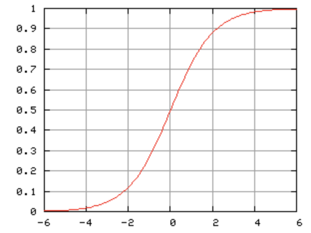

# ai-example

Книга Глубокое обучение Легкая разработка проектов на Python
#### source https://github.com/SethHWeidman/DLFS_code/

Нейросеть - это математическая функция, которая принимает входные и производит выходные данные.

Глубокое обучение:
1. Пропустить наблюдения через модель, отслеживая величины, вы- численные по пути во время этого «прямого прохода».
2. Рассчитать потери, показывающие, насколько прогнозы нашей модели отличаются от целевых результатов.
3. Используя величины, вычисленные на прямом проходе, и цепное правило, описанное в главе 1, вычислить, как сильно каждый из входных параметров влияет на величину ошибки.
4. Изменить значения параметров, чтобы при повторном проходе ошибка стала меньше.

Bias - смешения - позволяет модели учитывать различия в данных и изучать более гибкие границы решений. Используется для сдвига вывода функции активации в определенном направлении.
Основная причина использования смещения в нейронных сетях — улучшить способность модели соответствовать данным.
Вводя член смещения, модель может учитывать различия в данных, которые не фиксируются только входными признаками.
Это может помочь модели лучше обобщать новые данные и уменьшить влияние переобучения.

Weight - веса -  веса определяют вклад каждого нейрона в конечный результат. 

# Рассмотренная архитектура

### Operation

Базовая единица логики, содержащая прямой forward() и обратный проход(производную) backward()

### ParamOperation

Единица логики, содержащая параметры прохода (веса и смещения) и возвращающая градиент по функции и по параметрам

### WeightMultiply(ParamOperation)

Операция умножения матрицы входных параметров на их веса и при обратном проходе градиент операции и ее параметров

### BiasAdd(ParamOperation)

Операция добавления отклонения для входных параметров

### Sigmoid(Operation)

Сигмоидная функция активации

### Layer(Operation)

Аккумулирует операции слоя, количество нейронов, обновляет градиенты слоев и сохраняет градиент параметров

### Dense(Layer)

Полносвязный слой - хранит в себе функцию активации, применяет веса и смещения к входным параметрам

### Loss

Потери нейросети - сравние цели и предсказания, расчет потерь и его градиента

### MeanSquaredError(Loss)

Средне-квадратичная потеря

### NeuralNetwork

1. Нейронная сеть принимает на вход набор данных X и последовательно пропускает его через каждый слой 
(а на самом деле — через ряд операций), и полученным результатом будет прогноз.
2. Прогноз сравнивается с У,чтобы рассчитать потери и сгенерировать «градиент потерь»,
который является частной производной потери по каждому элементу в последнем слое 
в сети (который и создает прогноз).
3. Наконец, этот градиент проходит по сети в обратном направлении через каждый уровень
и вычисляются «градиенты параметров» — частная производная потерь по каждому из параметров.
Результаты сохраняются.

Содержит в себе список слоев, где каждый слой имеет количество нейронов и функцию активации. Вычисляет потери

### Optimizer

Оптимизатор - корректирует входные веса после итерации нейросети

### SGD(Optimizer)

Стохастический оптимизатор - содержит в себе скорость обучения и собственно сам алгоритм коррекции

### Trainer

1) Перемешивает данные в начале эпохи
2) Передавает данные через сеть в пакетном режиме, обновляя параметры.
3) Логирует
4) Контроллирует обучение

